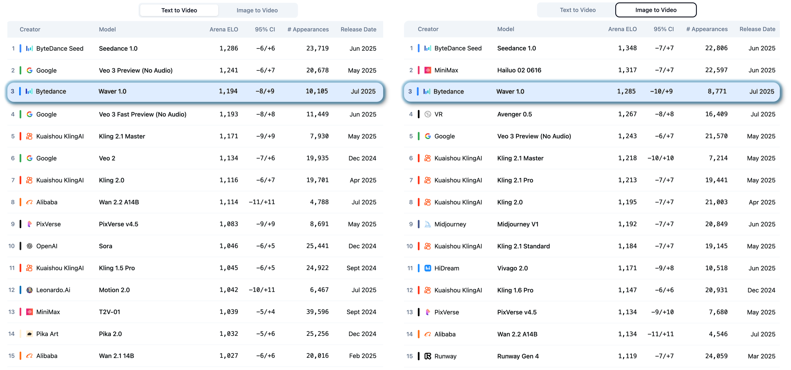
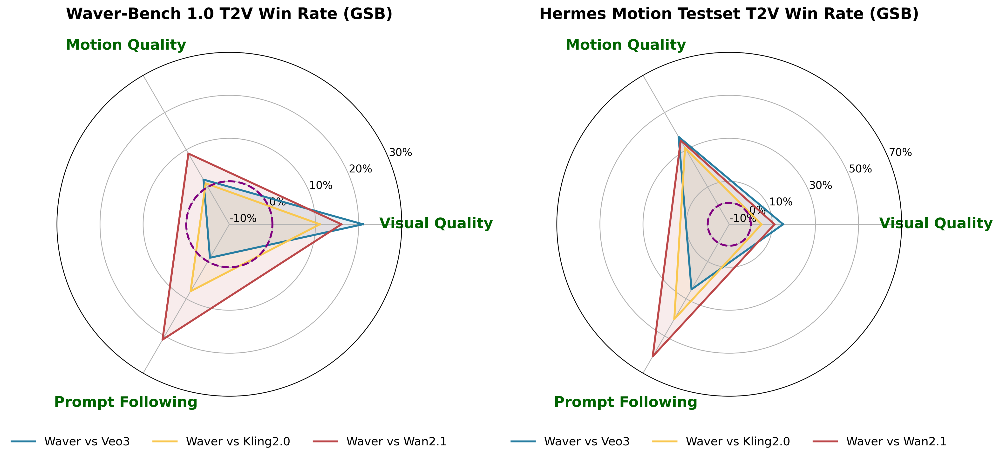
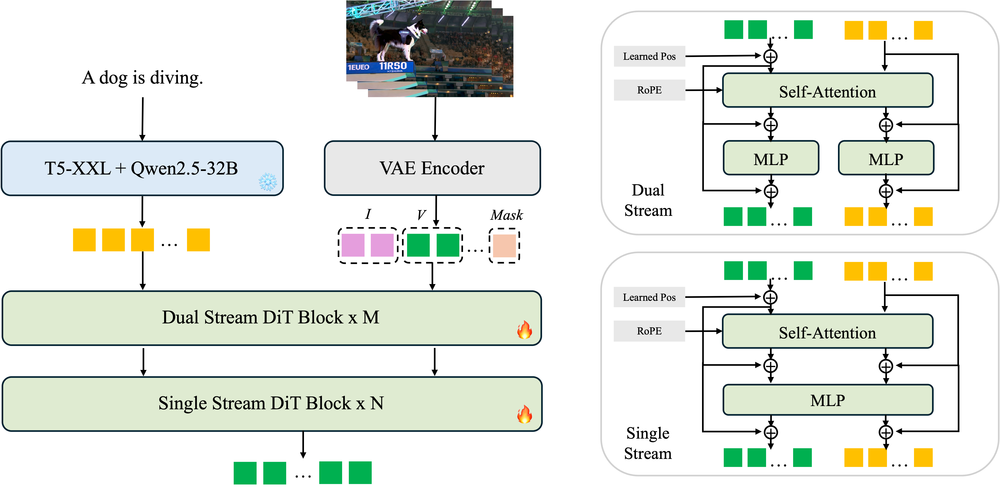
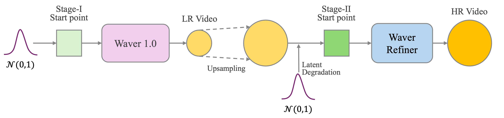
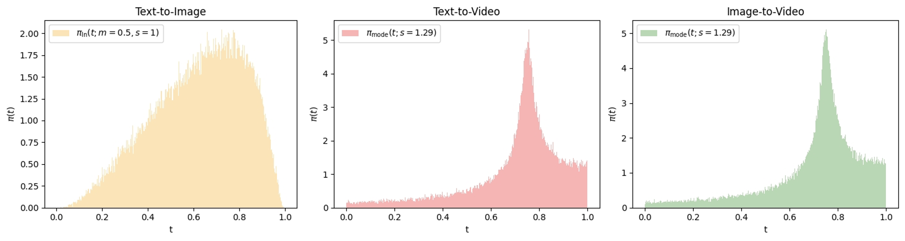

# Waver 1.0

<p align="center">
  
<p>

<div align="center">

  🌊 <a href="http://www.waver.video/"><u>Project Page</u></a>  &nbsp;  | &nbsp; 📖 <a href="https://arxiv.org/pdf/2508.15761"><u>Technical Report</u></a> &nbsp; | &nbsp; 🔥 <a href="http://opensource.bytedance.com/discord/invite"><u>Try generating videos with Waver on Discord</u></a> &nbsp;
  
</div>


---
## 🚀 Overview
**Waver 1.0** is a next-generation, universal foundation model family for unified image and video generation, built on rectified flow Transformers and engineered for industry-grade performance.
- 🌟 **All-in-One Model:** Simultaneously supports text-to-video (T2V), image-to-video (I2V), and text-to-image (T2I) generation within a single, integrated framework.
- 🌟 **1080p Resolution and Flexible Length:** Supports up to 1080p high-resolution image and video generation, with flexible resolution, aspect ratio, and video length (2–10 seconds).
- 🌟 **SOTA Performance:** Ranks in the **🏅Top 3** on both the [T2V leaderboard](https://artificialanalysis.ai/text-to-video/arena?tab=leaderboard&input=text
) & [I2V leaderboard](https://artificialanalysis.ai/text-to-video/arena?tab=leaderboard&input=image) at Artificial Analysis (data up to 2025-08-05 12:00 (GMT+8)), consistently outperforms existing open-source models and matches or exceeds state-of-the-art commercial solutions.
- 🌟 **Superior Motion Modeling:** Excels at capturing complex motion, achieving superior motion amplitude and temporal consistency in video synthesis.

<div align="left">
    
</div>

> [**Waver: Wave Your Way to Lifelike Video Generation**](https://arxiv.org/pdf/2508.15761)
> 
> Yifu Zhang, Hao Yang, Yuqi Zhang, Yifei Hu, Fengda Zhu, Chuang Lin, Xiaofeng Mei, Yi Jiang, Zehuan Yuan, Bingyue Peng
> 
> *[arXiv 2508.15761](https://arxiv.org/pdf/2508.15761)*

---

## 🎬 Demo
#### Aesthetics
<div align="left">
<video src="https://github.com/user-attachments/assets/bd6c66eb-a2b2-4013-8598-3474e946869b" width="100%" controls autoplay loop></video>
</div>

#### Motion
<div align="left">
<video src="https://github.com/user-attachments/assets/976b470e-aa05-421e-83f5-81eb9fd7ee74" width="100%" controls autoplay loop></video>
</div>

## 🏆 Benchmark Evaluation
#### Waver-Bench 1.0
In order to comprehensively evaluate the capabilities of the model and to explore the upper limits of its motion generation abilities, we propose Waver-bench 1.0. It consists of 304 samples covering a wide range of scenarios, including sports, daily activities, landscapes, animals, machinery, surreal scenes, animations, etc.
</br>
<div align="left">
<video src="https://github.com/user-attachments/assets/ed8d7e25-b0f4-4d9d-8b62-dbc14c65a5b2" width="100%" controls autoplay loop></video>
</div>

#### Hermes Motion Testset
Complex and large-amplitude motions have consistently posed significant challenges in the field of text-to-video generation. To systematically evaluate and compare the upper limits of various text-to-video models in terms of motion generation capabilities, we constructed a comprehensive benchmark dataset called Hermes Motion Testset. This evaluation set comprises 96 prompts, encompassing 32 distinct types of sports activities, including tennis, basketball, gymnastics, rowing, boxing, equestrianism, among others.
</br>
<div align="left">
<video src="https://github.com/user-attachments/assets/f44317de-bef8-42c1-8043-3e28620698be" width="100%" controls autoplay loop></video>
</div>

#### Comparison with SOTA
We compared **Waver1.0** with leading open-source and closed-source models on Waver-Bench 1.0 and Hermes Motion Testset in terms of motion quality, visual quality and prompt following. Through manual evaluation, **Waver1.0** are superior to those from both closed-source and open-source models.
</br>
<div align="left">
    
</div>


### 📖 Introduction of Waver1.0
**Waver1.0** is an all-in-one video generation model that excels in text-to-video (T2V), image-to-video (I2V), and text-to-image (T2I) generation. It offers flexible resolution and aspect ratio, arbitrary video length, and easily extensible for controllable video generation. 

##### (1) Model Architecture
We use [Wan-VAE](https://huggingface.co/Wan-AI/Wan2.1-T2V-14B/blob/main/Wan2.1_VAE.pth) to obtain the compressed video latent for its efficiency. We adopt [flan-t5-xxl](https://huggingface.co/google/flan-t5-xxl) and [Qwen2.5-32B-Instruct](https://huggingface.co/Qwen/Qwen2.5-32B-Instruct) to extract text features. Our DiT model is built upon rectified flow Transformers. Video and text modalities are fused using a Dual Stream + Single Stream approach, where the numbers of the two types of blocks are M and N. We achieve joint training of T2V and I2V within a single model simply by modifying the input channel, 16 for video token, 16 for image (first frame) token and 4 for task mask. We incorporate the image latent with a probability of 20% during joint training of T2V and I2V.

<div align="left">
      
</div>  

| Model  | M         | N      | Input Dimension |Output Dimension | Num of Head      | Head Dim |
|--------|-----------|--------|-----------------|-----------------|------------------|----------|
| 12B    | 16        | 40     | 36              |16               |24               | 128      | 

##### (2) Cascade Refiner for 1080P Generation
**Waver-Refiner** adopts the DiT architecture and is trained using the flow matching method. We first upsample the low-resolution video (480p or 720p) to 1080p and then add noise to it. The refiner takes the noised low-resolution video as input and outputs high-quality 1080p video. The refiner employs the window attention mechanism and reduces the number of inference steps by half, significantly improving inference speed. Specifically, inference time is reduced by **~40% for 720p→1080p** and **~60% for 480p→1080p** compared to direct 1080p generation.
<div align="left">
    
</div>

##### (3) Training Recipe
We found that training on low-resolution videos is crucial for learning motion. So we invested substantial computational resources in training on 192p videos, and then gradually increased the resolution to 480p and 720p. We follow the flow matching training setting in [SD3](https://arxiv.org/abs/2403.03206) to gradually increase the value of sigma shift when training on 480p and 720p videos. For 720p training, we set sigma shift to 3.0 in training and 7.0 in inferring. For T2I, we use lognorm(0.5, 1) probability density function for the sampling of timesteps. For T2V and I2V, we use mode(1.29). Empirically, we find that using the mode sampling strategy brings greater motion in video generation tasks.
<div align="left">
    
</div>

##### (4) Prompt Tagging
We employ a prompt tagging approach to distinguish between different types of training data. We assign distinct tags to the training data based on both the video style and the video quality. During training, we prepend the caption with a prompt describing the video's style. Regarding quality, we append a prompt describing video quality to the end of the training caption. During inference, we incorporate prompts describing undesirable qualities such as low definition or slow motion into the negative prompt. For specific style requirements (e.g., anime style), we prepend the corresponding descriptive prompt to the overall prompt using prompt rewriting techniques. 

The following videos show 6 different styles of the same prompt "A man and a woman are walking hand in hand along a bustling city street at night. ": Real, Ghibli-inspired 2D animation, 3D animation, 3D animation in voxel style, Disney animated film style, 2D animation in a cartoon picture book style.

<div align="left">
<video src="https://github.com/user-attachments/assets/94860ecd-9bfc-4801-8cad-152e4bcd2c6c" width="100%" controls autoplay loop></video>
</div>

##### (5) Inference Optimization
We extend [APG](https://arxiv.org/abs/2410.02416) to video generation to enhance realism and reduce artifacts. APG decomposes the update term in CFG into parallel and orthogonal components and down-weighting the parallel component to achieve high-quality generations without oversaturation. We find that normalizing the latent from [C, H, W] dimension achieves fewer artifacts than from [C, T, H, W] dimension. For the hyperparameters, we find the normalization threshold 27 and guidance scale 8 achieve a good balance between realism and artifacts.

<div align="left">
<video src="https://github.com/user-attachments/assets/56fcd9b0-e128-4a10-99cb-57c96d1f15fe" width="100%" controls autoplay loop></video>
</div>

## Citation

```bibtex
@article{zhang2025Waver,
  title={Waver: Wave Your Way to Lifelike Video Generation},
  author={Zhang, Yifu and Yang, Hao and Zhang, Yuqi and Hu, Yifei and Zhu, Fengda and Lin, Chuang and Mei, Xiaofeng and Jiang, Yi and Yuan, Zehuan and Peng, Bingyue},
  journal={arXiv preprint arXiv:2508.15761},
  year={2025}
}
```

